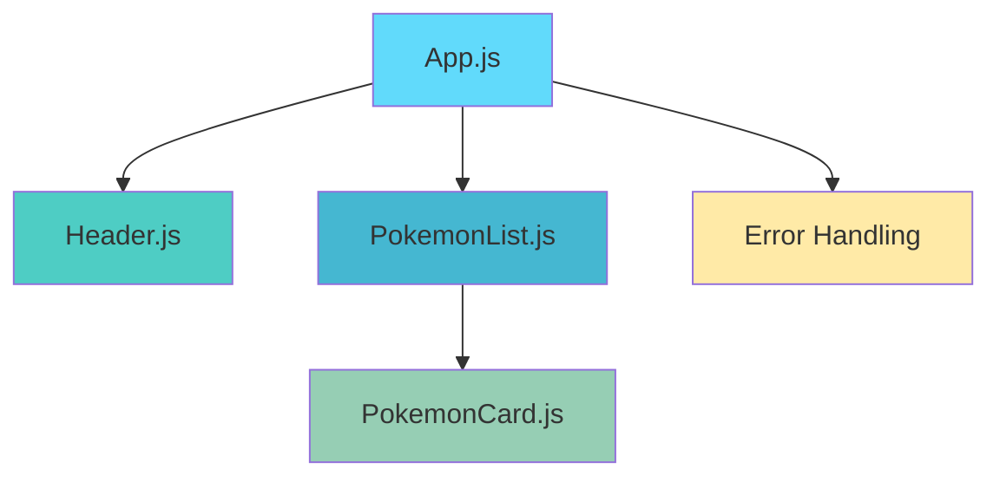

# 🔥 Pokédex Site

<div align="center">
  
  
  <p align="center">
    <strong>Uma aplicação moderna e responsiva para explorar o mundo Pokémon</strong>
  </p>
</div>

---

## 🎯 Sobre o Projeto

A **Pokédex** é uma aplicação web moderna desenvolvida em React que permite aos usuários pesquisar e explorar informações detalhadas sobre qualquer Pokémon. Utilizando a PokéAPI, a aplicação oferece uma experiência intuitiva e responsiva para fãs de Pokémon de todas as idades.

### 🎮 Por que este projeto?

- **Aprendizado prático** com React e APIs REST
- **Interface moderna** e user-friendly
- **Código limpo** e bem estruturado
- **Totalmente responsivo** para todos os dispositivos

---

## ✨ Funcionalidades

### 🔍 **Pesquisa Inteligente**
- Busca por **nome** ou **número** do Pokémon
- Pesquisa **case-insensitive**
- Validação de entrada em tempo real

### 📊 **Informações Completas**
- **ID e Nome** do Pokémon
- **Sprite oficial** em alta qualidade
- **Tipos** com cores temáticas
- **Habilidades** detalhadas

### 🎨 **Experiência do Usuário**
- **Interface intuitiva** e limpa
- **Feedback visual** para ações do usuário
- **Mensagens de erro** claras e amigáveis
- **Loading states** para melhor UX

### 📱 **Responsividade Total**
- **Mobile-first** design
- Compatível com **tablets** e **desktops**
- **Touch-friendly** para dispositivos móveis

---

## 🛠️ Tecnologias

<table>
  <tr>
    <td align="center" width="96">
      
      <br>React
    </td>
    <td align="center" width="96">
      
      <br>JavaScript
    </td>
    <td align="center" width="96">
      
      <br>CSS3
    </td>
    <td align="center" width="96">
      
      <br>HTML5
    </td>
  </tr>
</table>

### 📦 Principais Dependências

| Tecnologia | Versão | Descrição |
|------------|--------|-----------|
| **React** | `^18.3.1` | Biblioteca para construção de interfaces de usuário |
| **Axios** | `^1.7.7` | Cliente HTTP para requisições à API |
| **React Scripts** | `5.0.1` | Ferramentas de build e desenvolvimento |

---

## 🚀 Como Executar

### 📋 Pré-requisitos

- Node.js (versão 14 ou superior)
- npm ou yarn
- Git

### 🔧 Instalação

```bash
# Clone o repositório
git clone https://github.com/seu-usuario/pokemon-app.git

# Entre no diretório do projeto
cd pokemon-app

# Instale as dependências
npm install

# Inicie o servidor de desenvolvimento
npm start
```

### 🌐 Acesso

Após executar os comandos acima, a aplicação estará disponível em:
- **Local**: http://localhost:3000
- **Network**: http://[seu-ip]:3000

### 📦 Build para Produção

```bash
# Gere a build otimizada
npm run build

# Sirva os arquivos estáticos (opcional)
npm install -g serve
serve -s build
```

---

## 📁 Estrutura do Projeto

```
pokemon-app/
├── 📁 public/
│   ├── index.html
│   ├── manifest.json
│   └── robots.txt
├── 📁 src/
│   ├── 📁 components/
│   │   ├── Header.js
│   │   ├── PokemonCard.js
│   │   ├── PokemonList.js
│   │   ├── 📁 img/
│   │   └── 📁 styles/
│   │       └── App.css
│   ├── App.js
│   └── index.js
├── package.json
├── package-lock.json
└── README.md
```

### 🏗️ Arquitetura dos Componentes



---

## 🎨 Interface

### 🖥️ Desktop
- Layout centralizado e elegante
- Cards com hover effects
- Tipografia otimizada para leitura

### 📱 Mobile
- Design mobile-first
- Touch gestures otimizados
- Interface adaptativa

### 🎨 Paleta de Cores
- **Primária**: Tons de azul (#61DAFB)
- **Secundária**: Verde (#4ECDC4)
- **Accent**: Vermelho para erros (#FF6B6B)
- **Neutro**: Cinzas para textos (#333, #666)

---

## 🔗 API

### 📡 PokéAPI Integration

A aplicação consome a **[PokéAPI](https://pokeapi.co/)**, uma API REST gratuita e completa sobre Pokémon.

**Endpoint utilizado:**
```
GET https://pokeapi.co/api/v2/pokemon/{name_or_id}
```

### 📊 Dados Consumidos

```javascript
{
  "id": 1,
  "name": "bulbasaur",
  "sprites": {
    "front_default": "https://..."
  },
  "types": [
    {
      "type": {
        "name": "grass"
      }
    }
  ],
  "abilities": [
    {
      "ability": {
        "name": "overgrow"
      }
    }
  ]
}
```

### ⚡ Performance
- **Caching** de requisições
- **Error handling** robusto
- **Loading states** para melhor UX

---

## 📱 Responsividade

### 📐 Breakpoints

| Dispositivo | Largura | Layout |
|-------------|---------|---------|
| **Mobile** | < 768px | Single column, stack vertical |
| **Tablet** | 768px - 1024px | Adaptado para touch |
| **Desktop** | > 1024px | Layout completo |

### 🎯 Estratégias Mobile-First

- **Flexbox** para layouts flexíveis
- **Media queries** otimizadas
- **Touch-friendly** buttons (min 44px)
- **Readable fonts** em todas as telas

---

## 🤝 Contribuição

Contribuições são sempre bem-vindas! Para contribuir:

### 🔄 Processo de Contribuição

1. **Fork** o projeto
2. Crie uma **branch** para sua feature (`git checkout -b feature/AmazingFeature`)
3. **Commit** suas mudanças (`git commit -m 'Add some AmazingFeature'`)
4. **Push** para a branch (`git push origin feature/AmazingFeature`)
5. Abra um **Pull Request**

### 💡 Ideias para Contribuição

- [ ] Adicionar mais informações do Pokémon (stats, evoluções)
- [ ] Implementar sistema de favoritos
- [ ] Adicionar modo escuro/claro
- [ ] Melhorar animações e transições
- [ ] Adicionar testes unitários
- [ ] Implementar PWA features

---

## 📄 Licença

Este projeto está sob a licença MIT. Veja o arquivo [LICENSE](LICENSE) para mais detalhes.

---

<div align="center">
  <h3>🌟 Se gostou do projeto, deixe uma estrela! 🌟</h3>
  
  <p>Desenvolvido com ❤️ por <strong>Michael Eduardo</strong></p>
  
  <p>
    <a href="https://pokemons-app-ten.vercel.app/" target="_blank">
      
    </a>
  </p>
</div>

---

<div align="center">
  <sub>Built with React ⚛️ | Powered by PokéAPI 🔥 | Deployed on Vercel ▲</sub>
</div>
